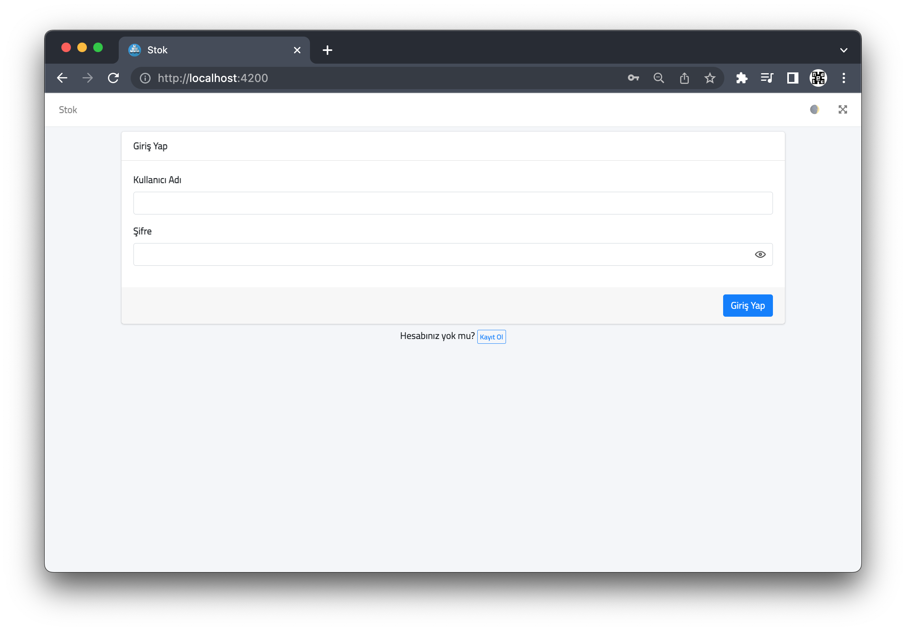
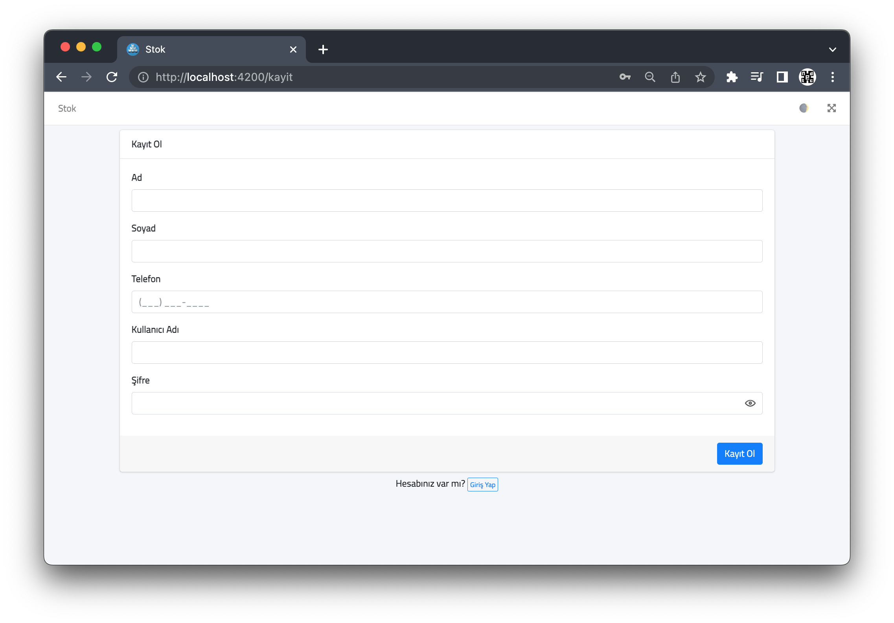
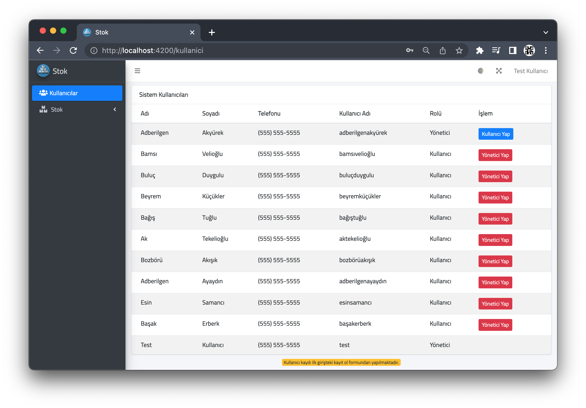
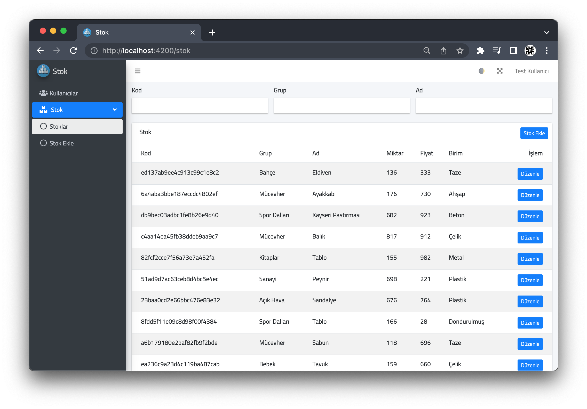
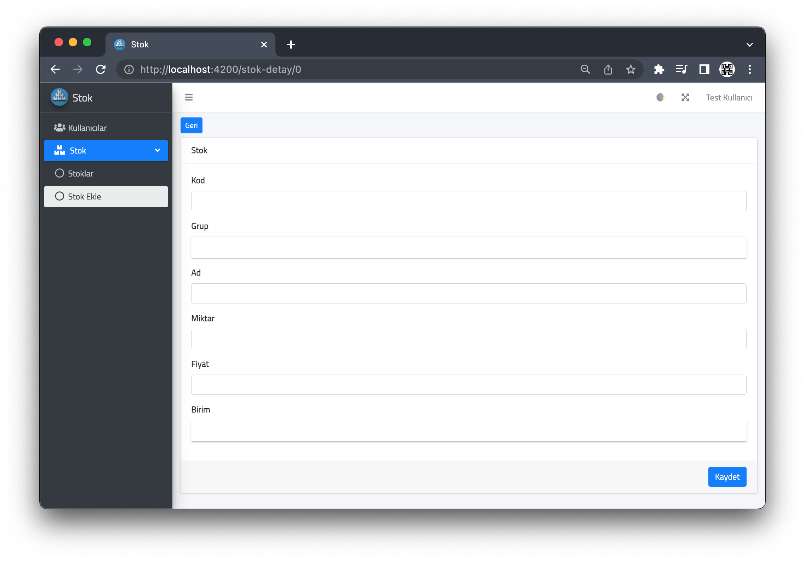
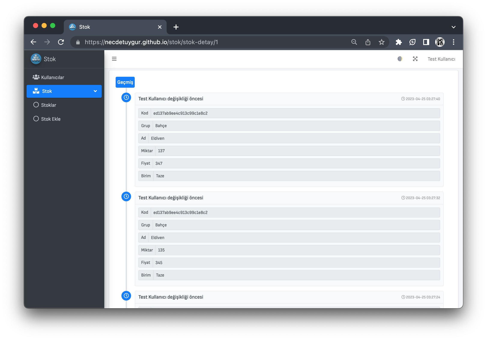
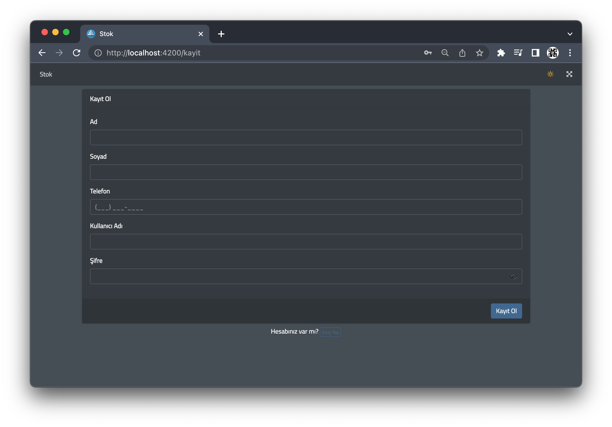
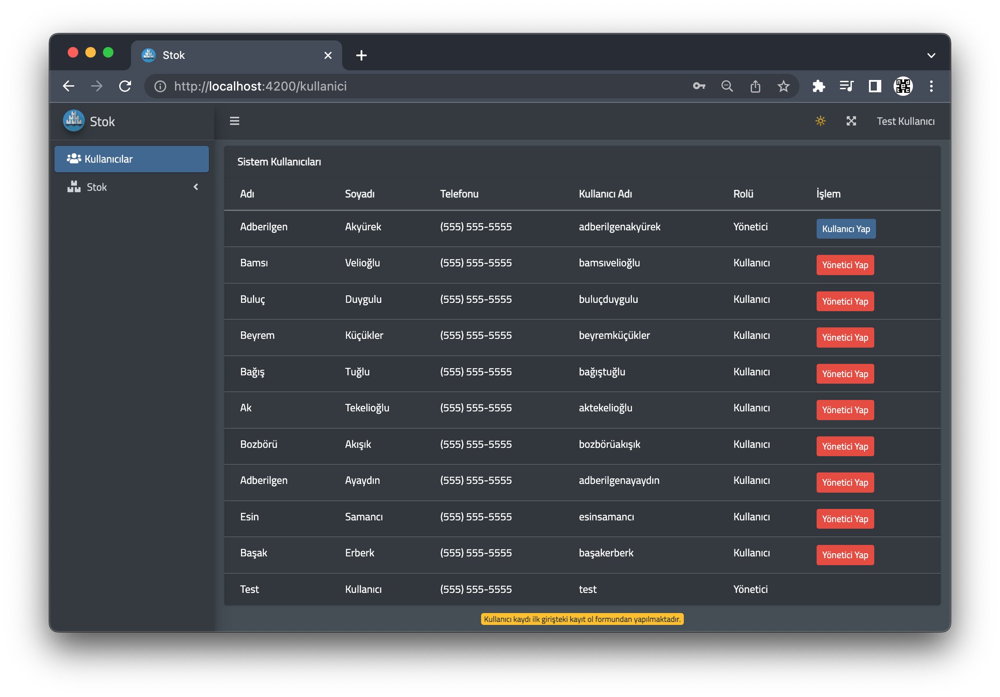

# Stok

## Canlı Adres

[https://necdetuygur.github.io/stok/](https://necdetuygur.github.io/stok/)

## API Host Servis Back-end Projesi

[https://github.com/necdetuygur/stok-api](https://github.com/necdetuygur/stok-api)

## Ekran Görüntüleri

### Giriş



### Kayıt



### Kullanıcılar



### Stoklar



### Stok Detay / Stok Ekle



### Stok Detay Geçmiş



### Kayıt (Karanlık)



### Kullanıcılar (Karanlık)



## gh-pages

```
git checkout -b gh-pages
ng add angular-cli-ghpages
ng deploy --base-href=https://necdetuygur.github.io/stok/
git stash
git checkout master
git branch -D gh-pages
```
