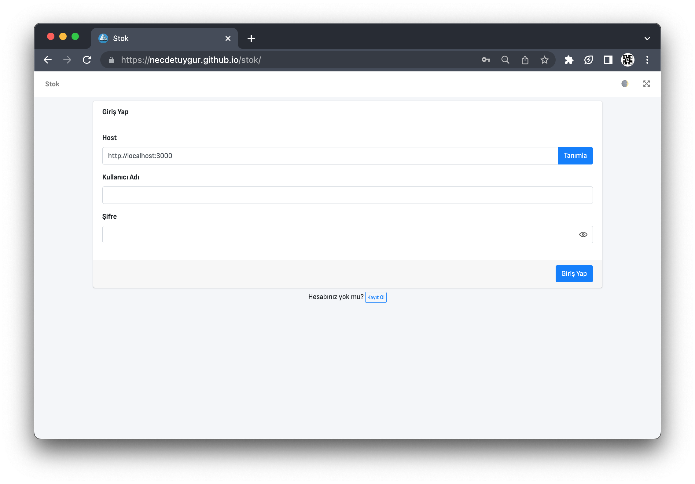

# Stok

## Canlı Adres

[https://necdetuygur.github.io/stok/](https://necdetuygur.github.io/stok/)

## API Host Servis Back-end Projesi

[https://github.com/necdetuygur/stok-api](https://github.com/necdetuygur/stok-api)

## Ekran Görüntüleri

<center><strong>Giriş</strong></center>



<center><strong>Kayıt</strong></center>


<center><strong>Kullanıcılar</strong></center>


<center><strong>Stoklar</strong></center>


<center><strong>Stok Detay / Stok Ekle</strong></center>


<center><strong>Kayıt (Karanlık)</strong></center>


<center><strong>Kullanıcılar (Karanlık)</strong></center>


## gh-pages

```
git checkout -b gh-pages
ng add angular-cli-ghpages
ng deploy --base-href=https://necdetuygur.github.io/stok/
git stash
git checkout master
git branch -D gh-pages
```
